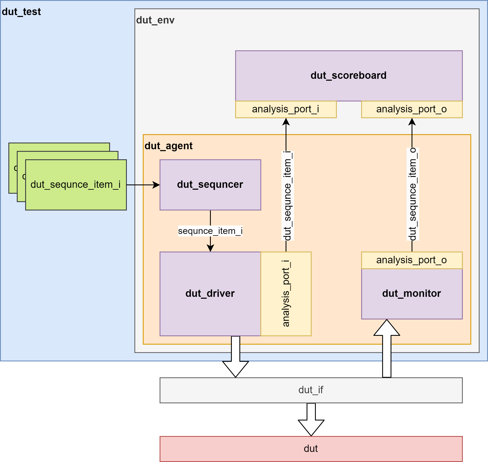

# Repository contents
* ./src/tb/scr1_pipe_ialu_tb_uvm.sv - testbanch for module scr1_pipe_ialu
* ./sim/win/uvm/ - source of uvm test environment
* ./sim/win/ - scripts for run testing
* ./sim/win/coverage-report-*.txt - coverage results
# run uvm test
OS Windows, HDL simulator is Questasim10.4
* cd ./sim/win
* modelsim_tb_uvm.bat
# uvm test (block diagram)

{width=40%}